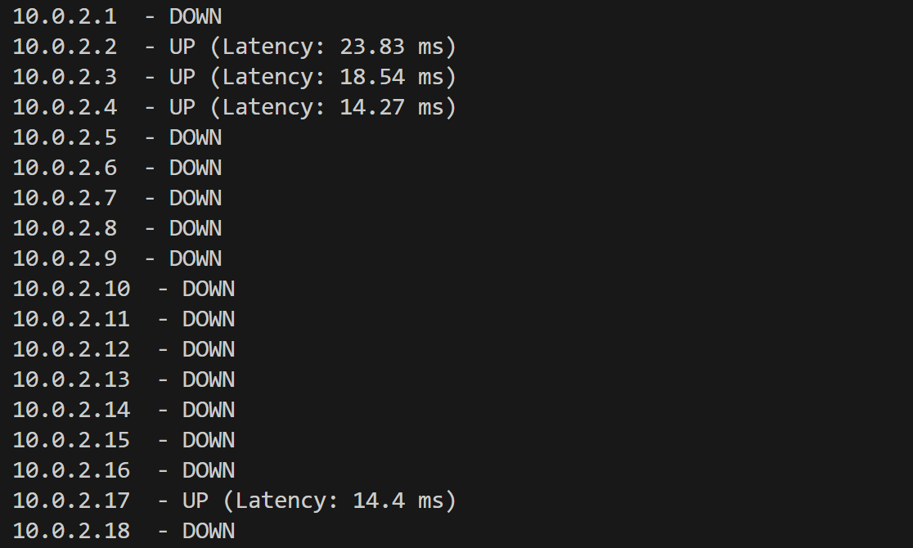
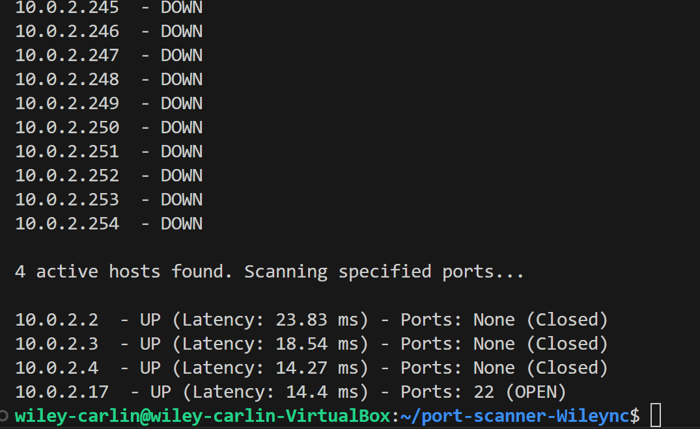

# Ip Address Scanner and Port Scanner
## Ip Address Scanner
A look at the output of the IP Address Scanner

This is a script that will take in a ip address with CIDR notation input (e.g., 192.168.1.0/24) and pings all availible ip hosts and returns their status.
 ## Why?
 We made this code so that we can run an ip address in CIDR notation to get all availible hosts in the given ip address list.  Once we have those ip addresses, we ping each host.  Then were given information about the ip address such as its UP or DOWN.
 ## How to run?
 To run this code, one would type python3 ipfreely.py (ip address in CIDR notation).  
 example:
 ```
 python3 ipfreely.py 10.0.2.16/24
 ```
 ## Excepted Responses?
 When run, we can expect two outputs... 
 ### UP 
 We can get the response UP followed by the response time it took to get a response from the ip address.  Example:
 ```
 10.0.2.2 is UP     - Response Time: 0.833 ms
 ```
 We get this response when the pinged ip address is active and being used.
 ### DOWN
 We can will get the Down response a lot, unless your on a busy network, you wont have a ton of IP addresses UP. A down response looks like this:
```
10.0.2.5 is DOWN - Request Timed Out
```
We get this response when and ip address isn't active or being used.

## Port Scanner
This port scanner uses a bunch of the same elements and lines from our IP address scanner. Only, in addition to scanning IP addresses and seeing if their active, the port scanner takes the IP addresses that are up, and checks to see if certain specified ports are open.
The output:

We find that there are four IP addresses that are up.

At the bottom of our output, we take all IP addresses that were up and we scan every port that we entered. 

We are reported the Status up the ip address(up), followed by the time it took to ping, its latency. And then it reports if any of the ports we specified are up. 

### How to run?
The IP address scanner takes in one argument whereas the Portscanner takes in an additional argument for the ports that are to be checked.
This is the command to run the code.
```
python3 port_scanner.py 10.0.2.17/24 -p 22
```
And from running this we get that port 22 is open on 10.0.2.17.

After -p, you can enter the ports you want scanned in three formats.
1. Straight up as a number for the port like - 22 - or - 80
2. A number list like - 22,80,443
3. A number range like - 22-443

All three work and report which ports are open however when using a range, a long range can take a long time to scan the ip addresses so a list is recommended.

Scanning ports can be helpful or even hurtful if used maliciously. Open ports can allow for backdoor entries. 